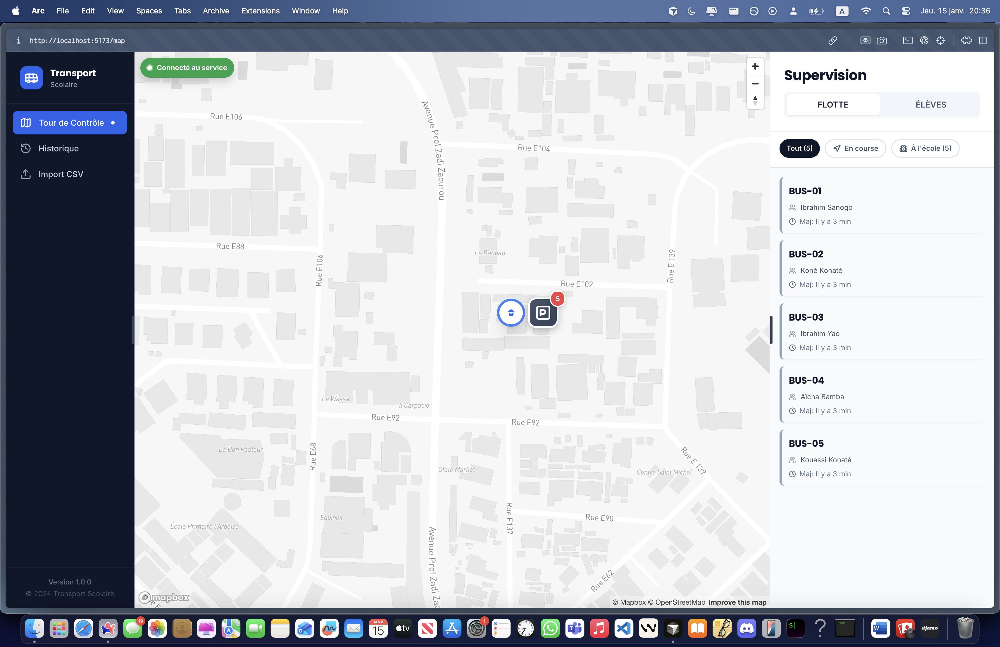
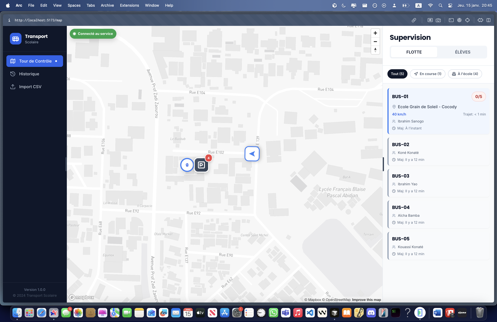
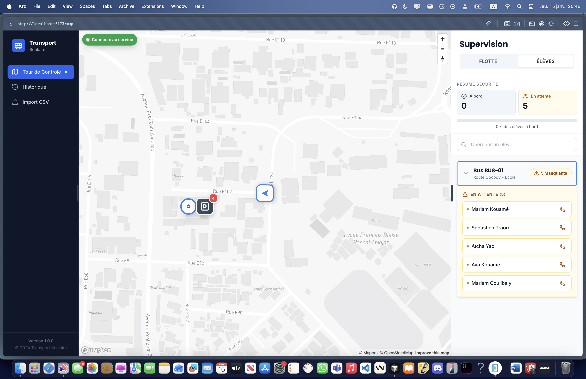
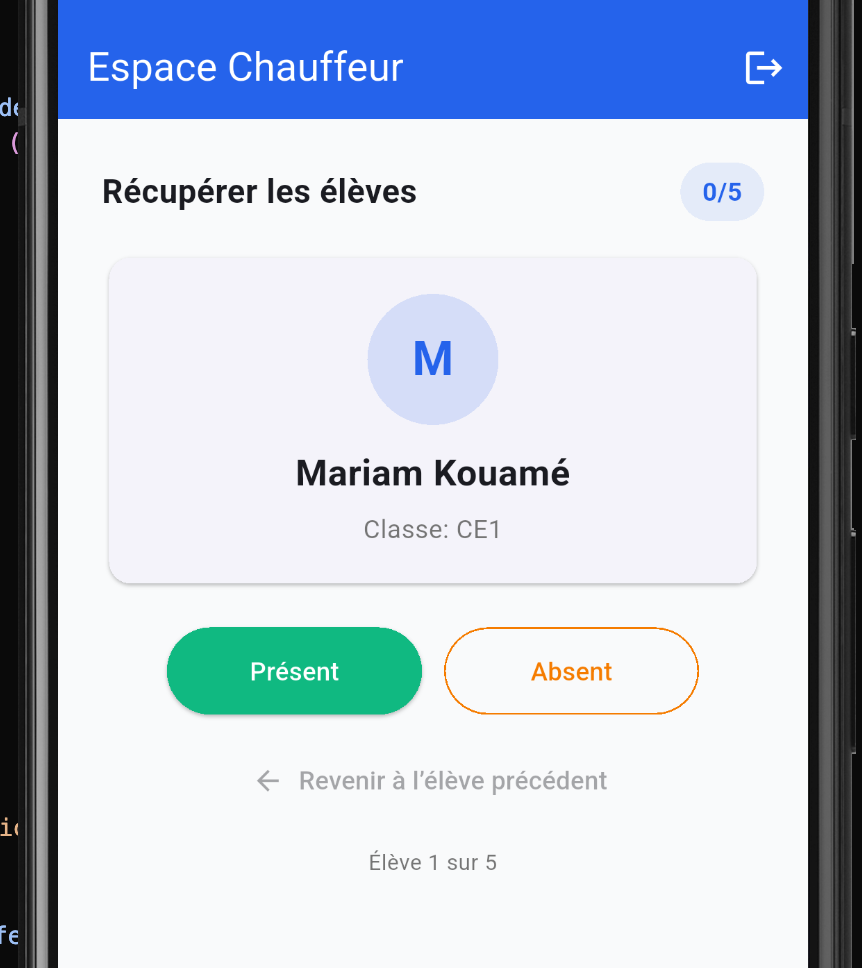

# Prototype – Bus Tracking System (Transport scolaire)

## Contexte

Ce projet est un **prototype logiciel** visant à explorer la conception d’un système de **suivi GPS pour le transport scolaire**, afin d’améliorer la visibilité et la coordination entre **écoles, parents et chauffeurs**.

Le projet a également servi de **première exploration d’un outil LLM (Claude Code)**, dans un cadre concret et orienté produit.

Il a été développé comme un **exercice de conception full-stack**, avec une architecture multi-clients (web et mobile) et un backend cloud.

---

## Problématique

Dans le transport scolaire :

* les parents manquent de visibilité sur les trajets,
* les écoles disposent de peu d’outils de supervision centralisée,
* le suivi des véhicules repose souvent sur des processus manuels ou informels.

---

## Solution proposée

Un système client-serveur permettant :

* le **suivi GPS des bus en temps réel**,
* la **visualisation cartographique de la flotte**,
* la **gestion de la présence des élèves**,
* une **séparation claire des rôles** (administration, chauffeurs, parents),
* la **centralisation des données** via un backend cloud.

Le projet est conçu comme un **prototype technique**, non comme un produit prêt pour la production.

---

## Aperçu du système

Interface de supervision web permettant à l’administration scolaire de suivre l’état de la flotte et des élèves.



---

## Interfaces et rôles

### Interface Web – Supervision de la flotte

L’interface web permet :

* de visualiser les bus sur une carte,
* de suivre leur état (en course, à l’école),
* d’identifier rapidement les anomalies.



---

### Interface Web – Suivi des élèves

Chaque bus expose l’état de présence des élèves (à bord / absents), permettant une supervision simple et immédiate.



---

### Application mobile – Chauffeur

L’application mobile est destinée aux chauffeurs et permet :

* de s’identifier,
* de sélectionner le type de course (matin, midi, après-midi, soir),
* de lancer une tournée.


---

### Application mobile – Gestion de la présence

Le chauffeur peut marquer chaque élève comme présent ou absent durant la tournée.



---

## Architecture générale

```
PROJET_BUS100/
├── backend/           # API backend (Node.js + TypeScript)
├── web-admin/         # Interface web d’administration (React)
└── mobile-parent/     # Application mobile (Flutter)
```

---

## Stack technique

### Backend

* Node.js
* TypeScript
* Firebase Cloud Functions
* Firestore
* Validation des entrées (Zod)

### Frontend Web

* React
* TypeScript
* Vite
* Cartographie (Mapbox)

### Mobile

* Flutter
* Firebase SDK
* Google Maps

---

## Fonctionnalités couvertes (prototype)

* Mise à jour et lecture de positions GPS
* Visualisation de la flotte sur carte
* Gestion basique des utilisateurs par rôle
* Suivi de présence des élèves
* Historique simple des trajets

---

## Lancer le projet (local)

### Prérequis

* Node.js ≥ 18
* Firebase CLI
* Flutter (pour l’application mobile)

### Backend

```bash
cd backend
npm install
firebase emulators:start
npm run dev:init
```

### Web admin

```bash
cd web-admin
npm install
npm run dev
```

Remarque : le projet nécessite un **projet Firebase configuré** pour fonctionner correctement.

---

## Statut du projet

* **Statut** : Prototype fonctionnel
* **Objectif** : démonstration technique et exploration d’architecture

### Limites connues

* règles de sécurité simplifiées,
* dépendance à Firebase,
* non prêt pour un usage en production,
* couverture de tests partielle.
