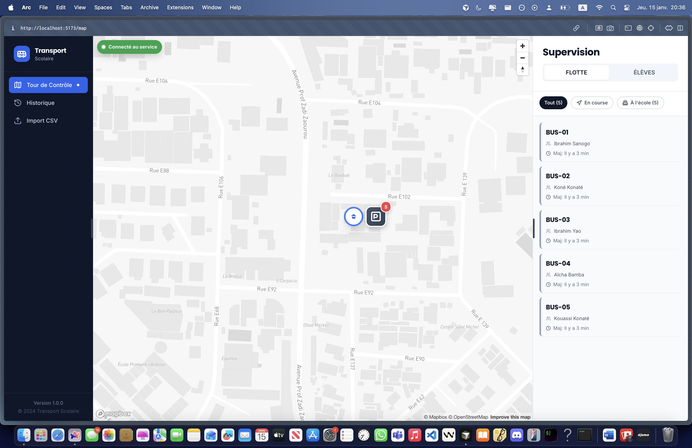
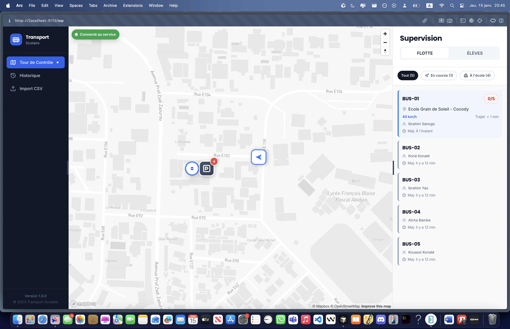
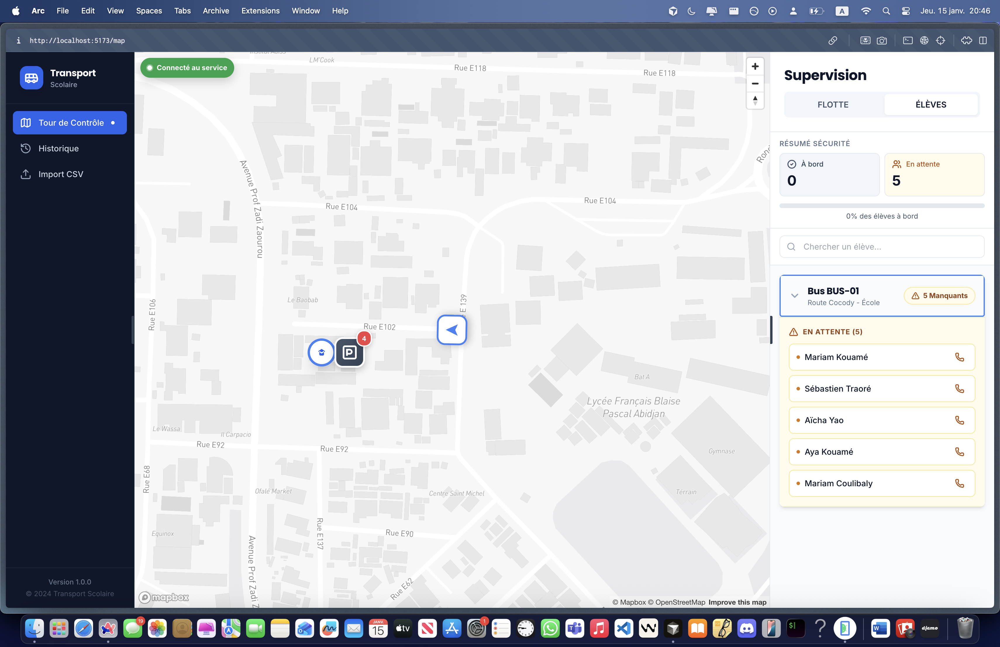
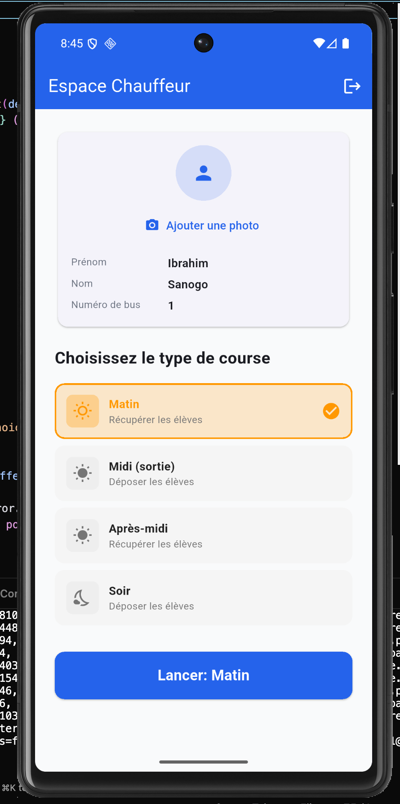
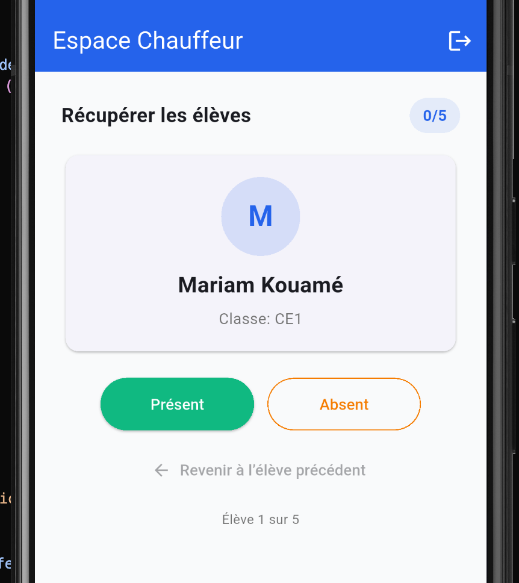

# Prototype – Bus Tracking System (Transport scolaire)

## Contexte

Ce projet est un **prototype logiciel** visant à explorer la conception d’un système de **suivi GPS pour le transport scolaire**, afin d’améliorer la visibilité et la coordination entre **écoles, parents et chauffeurs**.

Le projet a également servi de **première exploration d’un outil LLM (Claude Code)**, dans un cadre concret et orienté produit.

Il a été développé comme un **exercice de conception full-stack**, avec une architecture multi-clients (web et mobile) et un backend cloud.

---

## Problématique

Dans le transport scolaire :

* les parents manquent de visibilité sur les trajets,
* les écoles disposent de peu d’outils de supervision centralisée,
* le suivi des véhicules repose souvent sur des processus manuels ou informels.

---

## Solution proposée

Un système client-serveur permettant :

* le **suivi GPS des bus en temps réel**,
* la **visualisation cartographique de la flotte**,
* la **gestion de la présence des élèves**,
* une **séparation claire des rôles** (administration, chauffeurs, parents),
* la **centralisation des données** via un backend cloud.

Le projet est conçu comme un **prototype technique**, non comme un produit prêt pour la production.

---

## Aperçu du système

Interface de supervision web permettant à l’administration scolaire de suivre l’état de la flotte et des élèves.



---

## Interfaces et rôles

### Interface Web – Supervision de la flotte

L’interface web permet :

* de visualiser les bus sur une carte,
* de suivre leur état (en course, à l’école),
* d’identifier rapidement les anomalies.



---

### Interface Web – Suivi des élèves

Chaque bus expose l’état de présence des élèves (à bord / absents), permettant une supervision simple et immédiate.



---

### Application mobile – Chauffeur

L’application mobile est destinée aux chauffeurs et permet :

* de s’identifier,
* de sélectionner le type de course (matin, midi, après-midi, soir),
* de lancer une tournée.



---

### Application mobile – Gestion de la présence

Le chauffeur peut marquer chaque élève comme présent ou absent durant la tournée.



---

## Architecture générale

```
PROJET_BUS100/
├── backend/           # API backend (Node.js + TypeScript)
├── web-admin/         # Interface web d’administration (React)
└── mobile-parent/     # Application mobile (Flutter)
```

---

## Stack technique

### Backend

* Node.js
* TypeScript
* Firebase Cloud Functions
* Firestore
* Validation des entrées (Zod)

### Frontend Web

* React
* TypeScript
* Vite
* Cartographie (Mapbox)

### Mobile

* Flutter
* Firebase SDK
* Google Maps

---

## Fonctionnalités couvertes (prototype)

* Mise à jour et lecture de positions GPS
* Visualisation de la flotte sur carte
* Gestion basique des utilisateurs par rôle
* Suivi de présence des élèves
* Historique simple des trajets

---

## Lancer le projet (local)

Il existe **deux façons** de lancer le dashboard web :

| Mode | Backend / Firebase requis | Pour quoi |
|------|---------------------------|-----------|
| **Démo** (par défaut) | ❌ Non | Présentations, découverte, démos en école |
| **Réel** | ✅ Oui | Données live (Firestore + Cloud Functions) |

### 🚀 Démarrage rapide — Mode démo (recommandé pour une démo)

Le mode démo affiche des **bus simulés** qui roulent en temps réel vers l’école,
scannent les élèves et déclenchent des alertes — **sans aucun backend ni Firebase**.
Seul un token Mapbox (gratuit) est nécessaire pour le fond de carte.

```bash
cd web-admin
npm install
cp .env.example .env        # puis renseignez VITE_MAPBOX_ACCESS_TOKEN
npm run dev
```

Ouvrez ensuite `http://localhost:5173` : vous êtes connecté automatiquement et la
carte s’anime. Aucune étape de configuration Firebase n’est requise.

> Token Mapbox gratuit : https://account.mapbox.com/access-tokens/
> Le mode démo s’active **automatiquement** tant que Firebase n’est pas configuré
> (ou en forçant `VITE_DEMO_MODE=true`).

### Mode réel (données live)

#### Prérequis

* Node.js ≥ 18
* Firebase CLI (`npm install -g firebase-tools`)
* Java (pour les émulateurs Firestore/Auth)
* Flutter (uniquement pour l’application mobile)

#### Backend

```bash
cd backend
npm install
npm run serve          # build + émulateurs (functions, firestore, auth)
npm run dev:init       # (optionnel) données de démarrage dans l'émulateur
```

#### Web admin

```bash
cd web-admin
npm install
cp .env.example .env   # renseignez toute la config Firebase + Mapbox
npm run dev
```

Renseigner l’intégralité des variables `VITE_FIREBASE_*` bascule automatiquement
l’application en **mode réel**.

---

## Statut du projet

* **Statut** : Prototype fonctionnel, **relancé** avec un mode démo autonome
* **Objectif** : démonstration technique, démos en école, exploration d’architecture
* **Vérifié** : le web-admin compile, build et passe ses tests ; mode démo opérationnel sans backend

### Ce qui tourne sans backend (mode démo)

* Carte temps réel avec bus simulés convergeant vers l’école
* Scans d’élèves, alertes (retard, élève non ramassé), historique des courses
* Connexion automatique (aucun login requis)

### Limites connues

* Mode réel **dépendant de Firebase** (config + émulateurs ou projet cloud),
* règles de sécurité simplifiées,
* `npm run lint` du web-admin remonte une dette historique (`as any`) — sans impact sur le build,
* application mobile (Flutter) et émulateurs non couverts par le mode démo,
* non prêt pour un usage en production.
